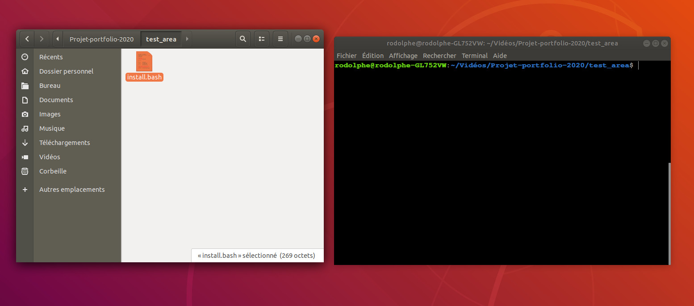
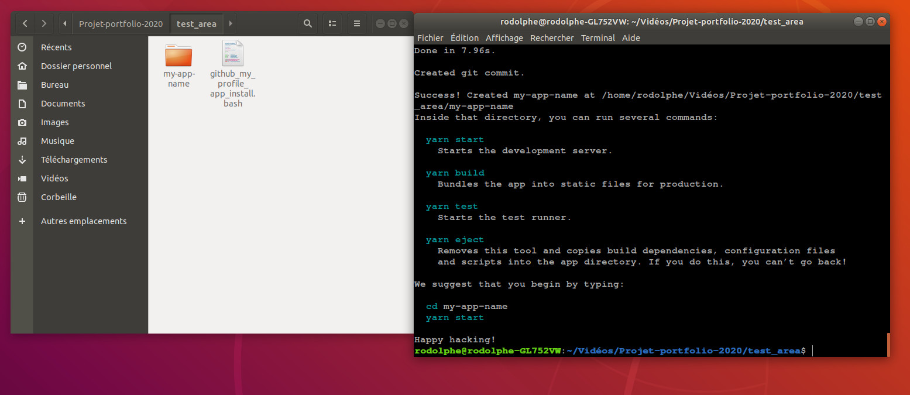

[](https://rodolphe-augusto.fr)
---
[](https://app.netlify.com/sites/my-github-pwa/deploys)
[](https://progressiveapp.store/pwa/PWA-My-Github)

# cra-template-github-my-profile

 - What the idea :
The idea was to create a progressive multilingual (multi-platform) web application displaying all the information necessary for a global and rapid vision of your Github account and to make it easily customizable for all developers, juniors and / or job seekers.
Possibly, this so that he can highlight their profile in front of potential employers and, therefore, increase the number of visitors to their github page.


***Github My Profile PWA (V2.0.0)***


- What is it :

This is the GithubMyProfile app template for [Create React App](https://github.com/facebook/create-react-app).

It is an open source multilingual (fr - en - pt) app licensed under the Creative Commons license.

Being a PWA, it is installable under most operating systems as well as under android (Tested myself).

 You can now have a quick view of your Github account information, such as:

- Your personal stats in real time among other statistics of the most used languages ​​on the platform.

- There is an "About" page and a footer that you can fully customize with your images, links, pdf, etc ...

- Also, there is a list of 50 of your "created by you" and 50 "forked" repositories.

To use this template when creating a new app it's really easy.


**here's how:**

---

## Solution 1

**🌟🌟The best & fastest solution**

With NPM package :
Juste type this in your console (with the name app you want)

``` bash

npx create-react-app <your-app-name-here> --template github-profile

```
***after that, go to :***
- "[How to personnalise yours GithubMyProfile application](https://github.com/rodolphe37/cra-template-github-my-profile/blob/master/template/README.md#customization-of-the-application)"

---

## Solution 2

**🌟another fastest solution**

**🚩 Important, the console must be opened in the folder where you want to install the application 🚩**

✅Download* and unzip* my automatic installation script

<sup>*the script can be downloaded and unzipped or you wish, you can delete it once the installation is complete ❕<sup>

✅open your console, then drag and drop the bash file into the console,

✅finally hit the enter key to start the installation.

✅afterwards, you just have to put the name of your application when asked,

✅then press Enter key to continue installation


<a id="raw-url" href="https://github.com/rodolphe37/cra-template-github-my-profile/blob/master/script_install/github_my_profile_app-1.4.4_install.zip?raw=true">👉 Download the zip file here 👈</a>




***after that, go to :***
- "[How to personnalise yours GithubMyProfile application](https://github.com/rodolphe37/cra-template-github-my-profile/blob/master/template/README.md#customization-of-the-application)"

---

## Solution 3

Put your app name in this line, at  ``` <YOUR NAME HERE> ``` and that's all!

```sh

# One ligne code (big, but one line only anyway)
mkdir packages && cd packages && git clone https://github.com/rodolphe37/cra-template-github-my-profile.git && cd .. && npx create-react-app <YOUR APP NAME HERE> --template file:./packages/cra-template-github-my-profile && rm -rf packages

```

after that, go to :
- "[How to personnalise yours GithubMyProfile application](https://github.com/rodolphe37/cra-template-github-my-profile/blob/master/template/README.md#customization-of-the-application)

---

For more information, please refer to:
- "[GithubMyProfile application](https://github.com/rodolphe37/pwa-react-project/blob/master/README.md)" The official repository of the open source project
- [Getting Started](https://create-react-app.dev/docs/getting-started) – How to create a new app.
- [User Guide](https://create-react-app.dev) – How to develop apps bootstrapped with Create React App.
- [Tutorial](https://medium.com/@alexgrischuk/how-to-create-custom-create-react-app-cra-templates-73a5196edeb) – How to create custom Create React App (CRA) templates


## License

Creative Commons


CC BY-NC-SA

**Attribution - No Commercial Use - Sharing under the Same Conditions**

[See the Explanatory Summary](https://creativecommons.org/licenses/by-nc-sa/4.0/) | [See the Legal Code](https://creativecommons.org/licenses/by-nc-sa/4.0/legalcode)

**This license allows others to remix, adapt, and build on your work for non-commercial purposes, as long as they credit you and license their new creations on the same terms.**

---
